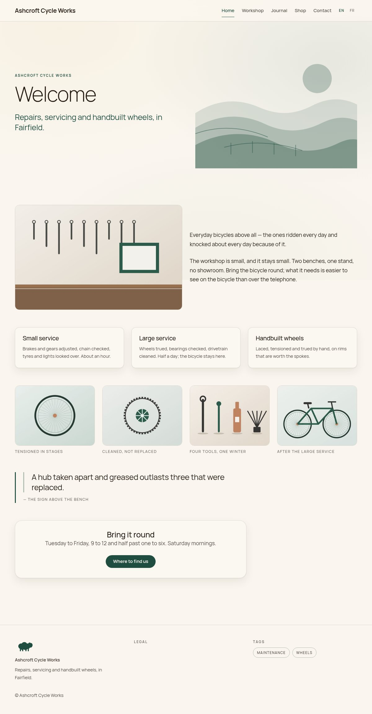
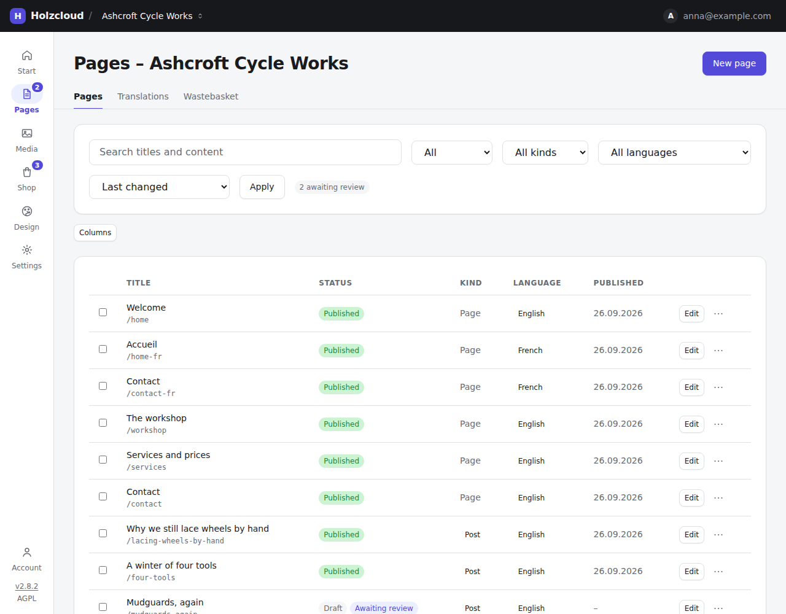
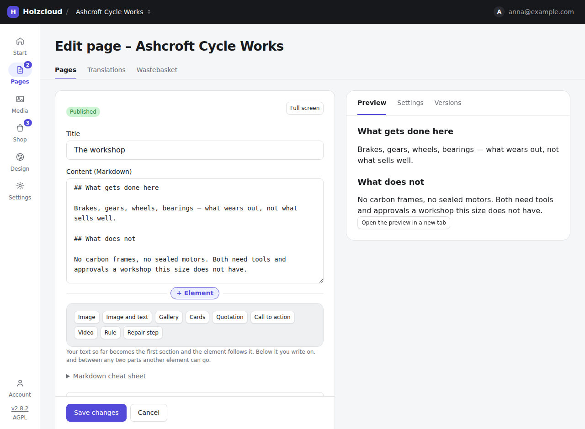
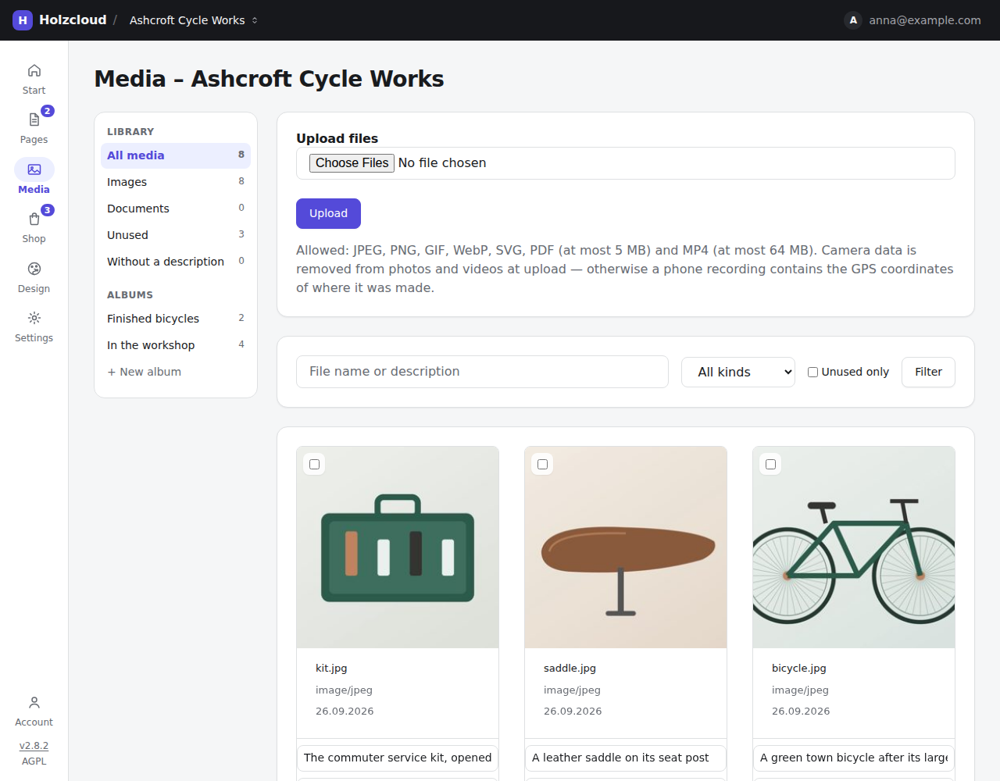
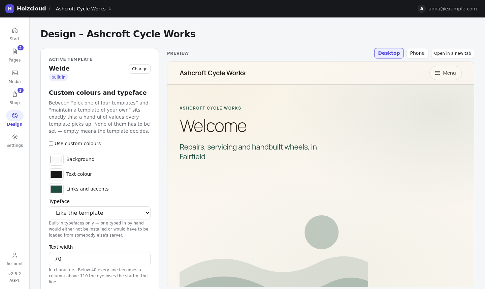
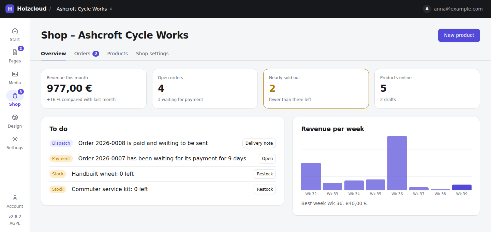
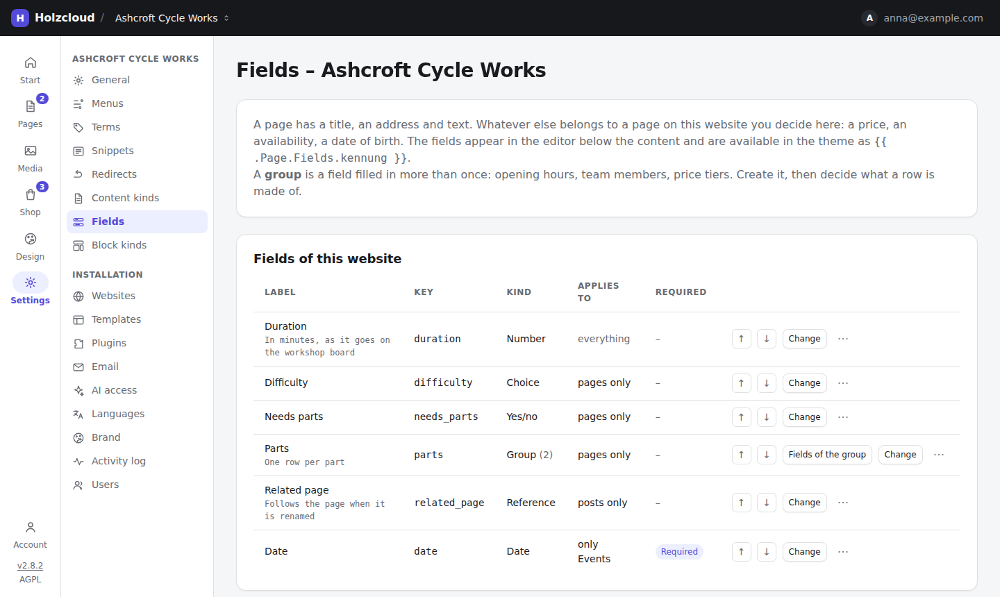

# Holzcloud CMS

A self-hosted CMS for a small server: **one Go binary, one SQLite file, many
websites**. Requests are routed to a site by their `Host` header, content is
written in Markdown with images, galleries and forms dropped in between, and
pages are served by server-rendered Go templates.

Nothing is loaded from a third party while the application runs — no CDN, no web
fonts, no analytics, no embeds. That is what makes a `default-src 'self'`
content security policy possible, and it is why a Holzcloud site needs no cookie
banner.

**Project page: <https://holzcloud.ch/holzcloud-cms>**



## Quick start

```bash
go build ./cmd/holzcloud
./holzcloud
```

Open <http://localhost:8080/admin>. The first visit asks you to create the
administrator account; administrators must then set up a second factor (any TOTP
app). After that you are in the dashboard, and the next step is **Websites →
New website**, where you give the site a domain.

## What it does

- **Multiple websites, multiple domains** — one instance, routed by `Host`
- **Pages and posts in Markdown**, rendered with goldmark and sanitised with bluemonday
- **Elements between the text** — **+ Element** drops an image, a gallery, cards,
  a quotation, a call to action, a video or a block kind of your own into the
  page; nine are built in, and any number of your own can be added
- **A live preview beside the editor**, with settings and versions in tabs
  next to it
- **Fields of your own** — sixteen kinds of input, including repeatable groups,
  sections, conditions and references to other pages of the same site
- **Content kinds of your own** — beyond *page* and *post*: product, event,
  recipe, animal, each with its own name, listing page, fields and filter
- **Eight built-in templates**, plus per-site colours, typeface, text width and
  corner rounding — or upload a template archive of your own
- **Multilingual sites** — the main language keeps its addresses, every further
  language lives under its prefix (`/fr/contact`), with `hreflang` and a language picker
- **A translated admin** — German, English, French, Italian, Spanish, plus Swiss
  variants; a further language is a JSON file in a directory, no rebuild
- **One media library with albums** — upload several files at once, filter
  what is unused or has no description, crop, set a focal point; **camera data
  is stripped on upload** and every file is checked by its magic bytes
- **A shop** — products with stock, orders with invoice or payment in advance
  (Payrexx optional), and an overview that says what is waiting: a payment
  overdue, an order to send, a product running out
- **Search, snippets, scheduling, redirects** and a record of the addresses
  visitors asked for and did not find
- **SEO** — `sitemap.xml`, `robots.txt` and schema.org JSON-LD with address,
  opening hours and telephone number
- **Export and import** — a whole website as one readable archive, a WordPress
  WXR importer, and `holzcloud export` for a static copy any web host can serve
- **Users** with admin and editor roles, per-person website and publishing
  rights, Argon2id hashing and compulsory two-factor for administrators
- **Sign-in through your organisation** — Authentik by forward auth, or any
  OpenID Connect provider (Authentik, Keycloak, Zitadel …) without the server
  ever contacting it; groups decide who is an administrator and which websites
  an editor may enter
- **An MCP endpoint** so you can point your own AI assistant at the running CMS
  and do everything the admin can, without ever signing in to the web interface —
  with a key of one of three levels (`read`, `content`, `admin`), or by simply
  adding the address in Claude or ChatGPT and agreeing to it once (OAuth)
- **Plugins** as separate Go modules — contact form, farm-shop orders, search,
  404 log, year token

## In the admin

Six places in a slim rail — start, pages, media, shop, design, settings — each
with a number when something there waits for you: pages awaiting review, orders
not yet dealt with, images without a description. htmx is progressive
enhancement, not a requirement: every state-changing action is an ordinary
form, and the whole admin works with JavaScript switched off.



A page is written in Markdown, with a preview of the real theme beside it.
**+ Element** puts an image, a gallery, cards or one of the website's own block
kinds — here a *Repair step* — between two paragraphs; the text so far becomes
the first section and the element follows it.



All files of a website are in one library. Albums are collections in it, not a
second place to keep pictures: an image can be in several, and a gallery can
show an album instead of a hand-picked list.



Design sits between "pick one of eight templates" and "maintain a template of
your own": a handful of validated values that every built-in template picks up,
set beside a live preview that switches between desktop and phone.



The shop opens on what is to be done, not on a list of orders.



Whatever else belongs on a page of *this* website is defined under **Fields**. A
field applies to pages, to posts, to both, or to exactly one of your own content
kinds. A condition reveals a field only once another is filled in; a group is
filled in as many times as there are rows; a reference points at another page of
the site and follows it when it is renamed.



## Configuration

Everything is set through environment variables prefixed `HOLZCLOUD_`. The ones
you are most likely to need:

| Variable | Default | Description |
|---|---|---|
| `HOLZCLOUD_PORT` | `8080` | HTTP listen port |
| `HOLZCLOUD_DATA_DIR` | `data` | SQLite database, media and uploaded templates |
| `HOLZCLOUD_SECURE` | `false` | Set `true` behind TLS — enables Secure cookies |
| `HOLZCLOUD_LOG_LEVEL` | `INFO` | `DEBUG`, `INFO`, `WARN`, `ERROR` |
| `HOLZCLOUD_SMTP_HOST` | — | Mail server; empty means no mail is sent at all |

The full list — upload limits, Argon2 cost, the remaining SMTP settings — is in
[`docs/configuration.md`](docs/configuration.md).

## Build and deploy

```bash
# Local
go build ./cmd/holzcloud

# Production (linux/amd64), ~23 MB, fully self-contained
CGO_ENABLED=0 GOOS=linux GOARCH=amd64 \
  go build -trimpath -ldflags="-s -w" -o holzcloud ./cmd/holzcloud
```

Templates, assets and migrations are embedded with `embed.FS`; there are no
external files to ship. `deploy/` holds a hardened systemd unit, a Caddyfile for
automatic HTTPS and a WAL-safe backup script — see
[`deploy/DEPLOY.md`](deploy/DEPLOY.md) and
[`docs/deployment.md`](docs/deployment.md).

## Architecture

```
cmd/holzcloud/            Entry point, route wiring, middleware, embedded assets
internal/
  config/                 Environment-based configuration
  db/                     SQLite dual pool (single writer), WAL, goose migrations
  auth/                   Argon2id, SCS sessions, CSRF, TOTP, middleware
  domain/                 Websites, domains, host resolver
  page/                   Pages, Markdown pipeline, slugs, versions
  block/  field/          The block editor and the websites' own fields
  admin/  public/         Admin handlers and the public site
  template/  tmplmgr/     Template loading and template-archive upload
  media/  album/  menu/    Media library, albums, menus
  shop/  payrexx/         Products, orders, payment
  bundle/  export/  wxr/  Website archives, static export, WordPress import
  ai/                     The MCP endpoint, keys and OAuth
  i18n/                   Admin translations, on disk and embedded
plugins/                  Bundled plugins, each its own Go module
sites/                    Complete example websites as readable source
tools/                    mkbundle, i18n and the other checks CI runs
```

| Component | Choice | Why |
|---|---|---|
| Language | Go 1.26 | Single binary, standard library first |
| Database | SQLite via `modernc.org/sqlite` | Pure Go — a static binary with no C toolchain |
| Sessions | `alexedwards/scs/v2` | Server-side sessions in SQLite |
| CSRF | `gorilla/csrf` | Middleware, integrated with htmx headers |
| Migrations | `pressly/goose/v3` | Embedded SQL, run at startup |
| Markdown | `yuin/goldmark` | CommonMark compliant |
| Sanitiser | `microcosm-cc/bluemonday` | Prevents XSS from user content |
| Frontend | htmx 2.0 and plain CSS | No build step, no npm, no bundler |

## Documentation

| Document | What is in it |
|---|---|
| [Configuration](docs/configuration.md) | Every environment variable, e-mail, the data directory |
| [Content model](docs/content-model.md) | Fields, content kinds, block kinds, snippets |
| [Publishing](docs/publishing.md) | Pages, menus, media, templates, design, SEO, plugins |
| [Multilingual](docs/multilingual.md) | Site languages, admin languages, regional variants |
| [Security](docs/security.md) | The threat model, two-factor, rights, why there is no cookie banner |
| [Import and export](docs/import-export.md) | Website bundles, the WordPress importer |
| [AI access](docs/ai-access.md) | The MCP endpoint, key levels and its tools |
| [Deployment](docs/deployment.md) | Building, running, backing up, versioning |
| [The mark](docs/brand/README.md) | The logo, its variants and the rules for using it |

`CHANGELOG.md` records what changed; `CONTRIBUTING.md` describes how to work on
it. The screenshots above show a fictional example site; its source is in
[`sites/`](sites/README.md). The project page is at
<https://holzcloud.ch/holzcloud-cms>.

## Versioning

The public record starts at **`v1.4`** — the point from which the project
continues in the open, not the point at which it began; it was developed in a
private repository before that. Releases have run on from there, and the
milestones under `.planning/` share the numbering.

The version is written into the binary at build time from `git describe`, so a
tag has to be reachable from `HEAD` — without one, `--always` puts a bare commit
hash there instead. Ask a running binary what it thinks it is:

```bash
./holzcloud version
```

## Licence

**[GNU Affero General Public License v3.0](LICENSE)** — the full text is in
[`LICENSE`](LICENSE).

Free software: you may use, study, change and share it. The condition is
reciprocity, and the *Affero* part is the one that matters for a CMS — running a
modified version as a service counts as distribution, so anyone you serve it to
has a right to that version's source. Self-hosting it unchanged, for yourself or
for clients, obliges you to nothing beyond keeping the notices.

The bundled fonts carry their own licences — Manrope and JetBrains Mono under the
SIL Open Font License 1.1; provenance and checksums are recorded in
[`cmd/holzcloud/assets/VENDOR.md`](cmd/holzcloud/assets/VENDOR.md). Third-party Go
modules keep their own terms, and a plugin is a separate module that may carry
its own.

Contributions are accepted under the same licence — see
[`CONTRIBUTING.md`](CONTRIBUTING.md), the [code of
conduct](CODE_OF_CONDUCT.md) and the [security policy](SECURITY.md).
