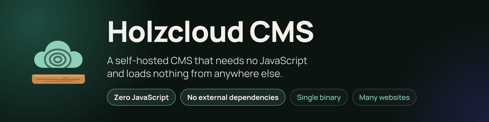
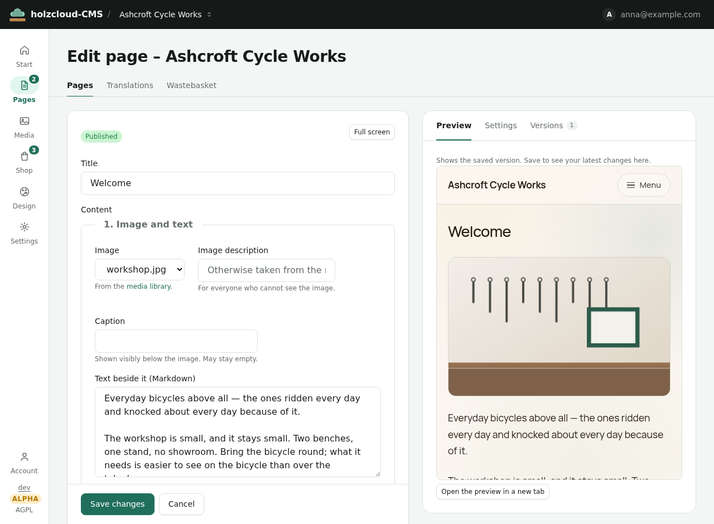
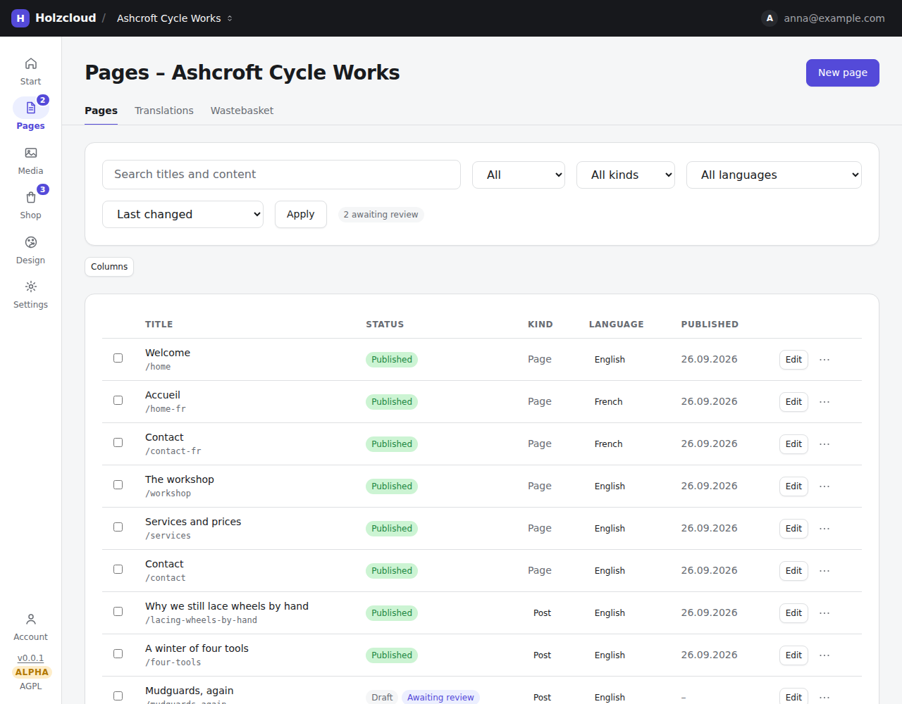
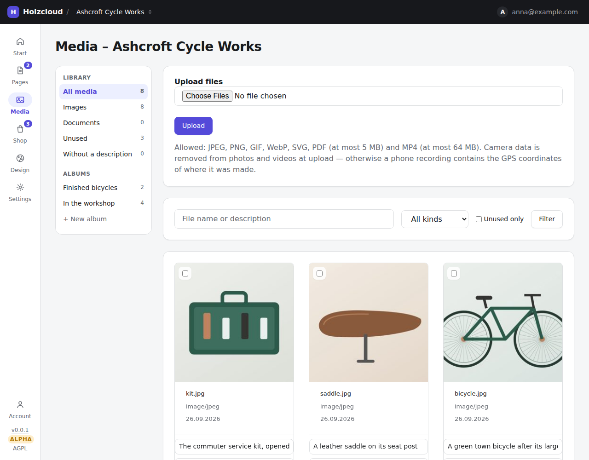
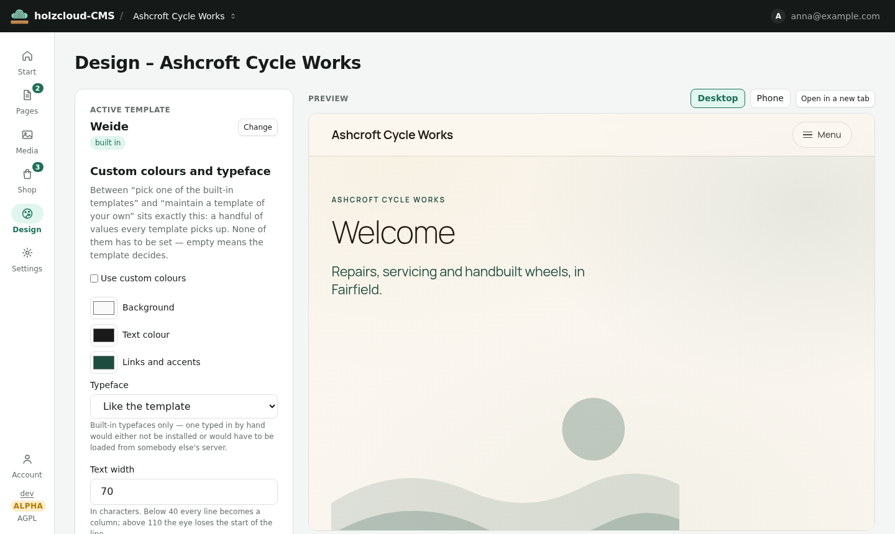
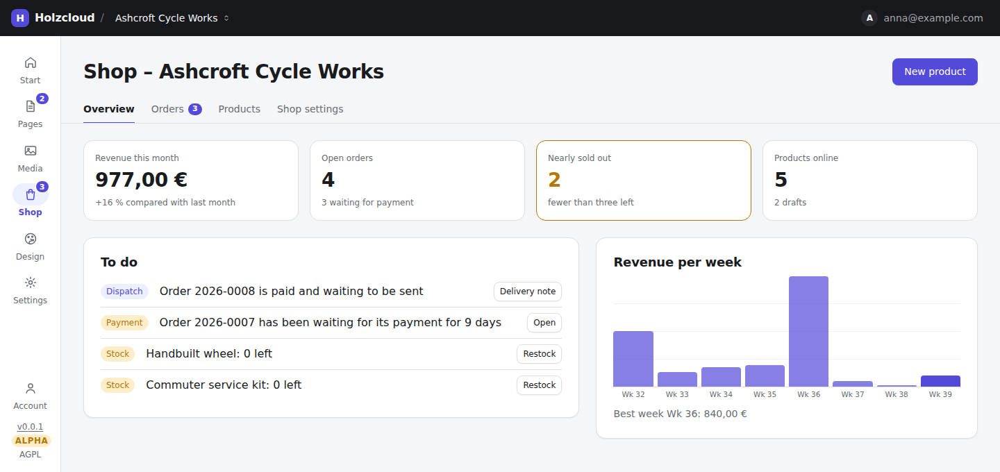
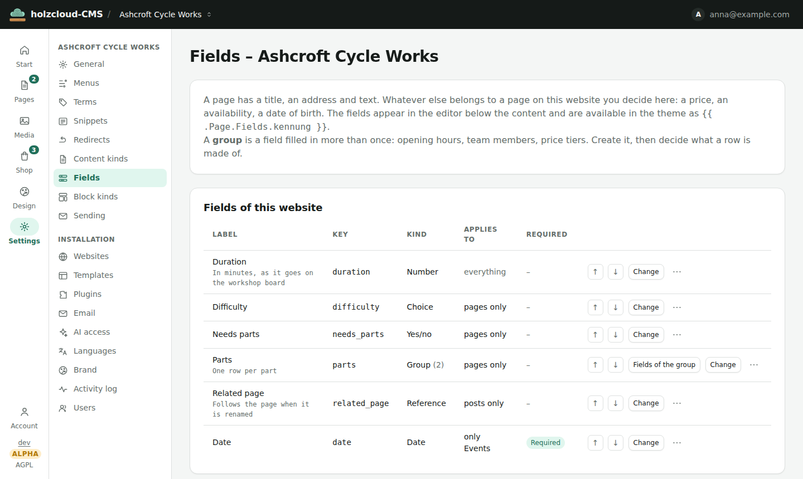
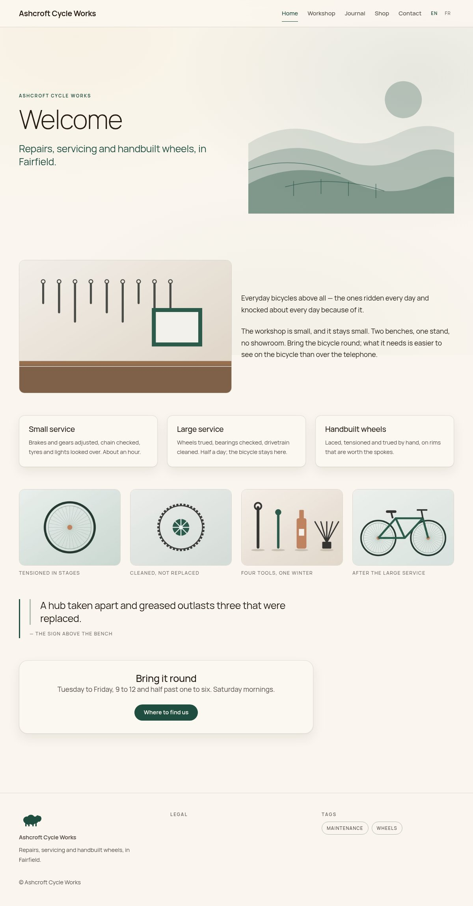

<p align="center">
  
</p>

<p align="center">
  
  
</p>

<p align="center">
  
  <a href="https://github.com/holzcloud/holzcloud-cms/releases"></a>
  <a href="https://github.com/holzcloud/holzcloud-cms/actions/workflows/ci.yml"></a>
  
  
  <a href="LICENSE"></a>
</p>

<p align="center">
  <b><a href="https://holzcloud.ch/holzcloud-cms">Project page</a></b> ·
  <a href="deploy/DEPLOY.md">Deploying</a> ·
  <a href="#documentation">Documentation</a> ·
  <a href="https://github.com/holzcloud/holzcloud-cms/releases">Releases</a>
</p>

**Holzcloud CMS** is a self-hosted CMS for a small server that **needs no
JavaScript and loads nothing from anywhere else**. One Go binary, one SQLite
file, many websites: requests reach a site by their `Host` header, pages are
written in Markdown with images, galleries and forms dropped in between, and
they are served by server-rendered Go templates.

## No JavaScript. Nothing from elsewhere.

That is the point of it, and it holds everywhere, not just by default:

- **The websites ship no JavaScript at all.** Not the eight built-in templates,
  and not one somebody uploads: an archive carrying a script, an `onclick` or a
  `javascript:` link is refused at upload. What a visitor gets is HTML and CSS.
- **The admin works with JavaScript switched off.** Every action is an ordinary
  form; htmx, served from this server, only makes it quicker, and a test holds
  every htmx action to the plain form that does the same thing.
- **Nothing is fetched from a third party while it runs** — no CDN, no web
  fonts, no analytics, no embeds, no update check. Fonts are compiled into the
  binary. A `default-src 'self'` content security policy is sent with every
  page, and an uploaded template that references anything external is refused
  before it can break a site. The only connections out are the ones you
  configure yourself: your mail server, and Payrexx if the shop takes payment
  online.
- **Nothing else to install.** No database server, no PHP, no Node, no build
  step: one static binary with the templates, assets and migrations inside it.
  Even signing in through your identity provider (OpenID Connect) happens
  without this server contacting it.

What follows from it: a Holzcloud site is fast on any phone, keeps working when
somebody else's service is down, leaks no visitor to anybody, and needs no
cookie banner.

> [!WARNING]
> **Holzcloud CMS is alpha software under heavy development.** Features,
> settings, the template contract and the AI tools can change or disappear from
> one release to the next, without a transition period. Back up the data
> directory before every update and read the [changelog](CHANGELOG.md) first.



## What it does

- **Multiple websites, multiple domains** — one instance, routed by `Host`
- **Pages and posts in Markdown**, rendered with goldmark and sanitised with bluemonday
- **Elements between the text** — **+ Element** drops an image, a gallery, cards,
  a quotation, a call to action, a video or a block kind of your own into the
  page; nine are built in, and any number of your own can be added
- **A live preview beside the editor**, with settings and versions in tabs
  next to it
- **Fields of your own** — sixteen kinds of input, including repeatable groups,
  sections, conditions and references to other pages of the same site
- **Content kinds of your own** — beyond *page* and *post*: product, event,
  recipe, animal, each with its own name, listing page, fields and filter
- **Eight built-in templates**, plus per-site colours, typeface, text width and
  corner rounding — or upload a template archive of your own
- **Multilingual sites** — the main language keeps its addresses, every further
  language lives under its prefix (`/fr/contact`), with `hreflang` and a language picker
- **A translated admin** — German, English, French, Italian, Spanish, plus Swiss
  variants; a further language is a JSON file in a directory, no rebuild
- **One media library with albums** — upload several files at once, filter
  what is unused or has no description, crop, set a focal point; **camera data
  is stripped on upload** and every file is checked by its magic bytes
- **A shop** — products with stock, orders with invoice or payment in advance
  (Payrexx optional), and an overview that says what is waiting: a payment
  overdue, an order to send, a product running out
- **Search, snippets, scheduling, redirects** and a record of the addresses
  visitors asked for and did not find
- **SEO** — `sitemap.xml`, `robots.txt` and schema.org JSON-LD with address,
  opening hours and telephone number
- **Export and import** — a whole website as one readable archive, a WordPress
  WXR importer, and `holzcloud export` for a static copy any web host can serve
- **Users** with admin and editor roles, per-person website and publishing
  rights, Argon2id hashing and compulsory two-factor for administrators
- **Sign-in through your organisation** — Authentik by forward auth, or any
  OpenID Connect provider (Authentik, Keycloak, Zitadel …) without the server
  ever contacting it; groups decide who is an administrator and which websites
  an editor may enter
- **An MCP endpoint** so you can point your own AI assistant at the running CMS
  and do everything the admin can, without ever signing in to the web interface —
  with a key of one of three levels (`read`, `content`, `admin`), or by simply
  adding the address in Claude or ChatGPT and agreeing to it once (OAuth)
- **Plugins** as separate Go modules — contact form, farm-shop orders, search,
  404 log, year token

## A look around

Six places in a slim rail — start, pages, media, shop, design, settings — each
with a number when something there waits for you: pages awaiting review, orders
not yet dealt with, images without a description. htmx is progressive
enhancement, not a requirement: every state-changing action is an ordinary
form, and the whole admin works with JavaScript switched off.



A page is written in Markdown, with a preview of the real theme beside it.
**+ Element** puts an image, a gallery, cards or one of the website's own block
kinds — here a *Repair step* — between two paragraphs; the text so far becomes
the first section and the element follows it.


All files of a website are in one library. Albums are collections in it, not a
second place to keep pictures: an image can be in several, and a gallery can
show an album instead of a hand-picked list.



Design sits between "pick one of eight templates" and "maintain a template of
your own": a handful of validated values that every built-in template picks up,
set beside a live preview that switches between desktop and phone.



The shop opens on what is to be done, not on a list of orders.



Whatever else belongs on a page of *this* website is defined under **Fields**. A
field applies to pages, to posts, to both, or to exactly one of your own content
kinds. A condition reveals a field only once another is filled in; a group is
filled in as many times as there are rows; a reference points at another page of
the site and follows it when it is renamed.



**The public side.** Eight built-in templates, set here to *Weide*, and every
subresource from the site's own origin: no CDN, no web font service, no
analytics, and so no cookie banner.



## Quick start

Download `holzcloud-linux-amd64` from the
[newest release](https://github.com/holzcloud/holzcloud-cms/releases) and
compare it with the `.sha256` file beside it, then:

```sh
chmod +x holzcloud-linux-amd64
./holzcloud-linux-amd64
```

Open <http://localhost:8080/admin> and create the first account; an
administrator sets up a second factor (any TOTP app) right after. The next step
is **Websites → New website**, where the site gets its domain.

Prefer a container? The image is `ghcr.io/holzcloud/holzcloud-cms`, built from
the [`Dockerfile`](Dockerfile) in this repository. To build from source you
need Go 1.26 and nothing else:

```sh
CGO_ENABLED=0 go build -trimpath -ldflags="-s -w" -o holzcloud ./cmd/holzcloud
```

Templates, assets and migrations are embedded, so the one file is the whole
application. Everything is configured through `HOLZCLOUD_*` variables
([configuration](docs/configuration.md)); a hardened systemd unit, a Caddyfile
for automatic HTTPS and a WAL-safe backup script are in [`deploy/`](deploy/DEPLOY.md).

## Documentation

- [Deploying](deploy/DEPLOY.md) — systemd, Caddy, backups, single sign-on, releases
- [Configuration](docs/configuration.md) — every environment variable, e-mail, the data directory
- [Content model](docs/content-model.md) — fields, content kinds, block kinds, snippets
- [Publishing](docs/publishing.md) — pages, menus, media, templates, design, SEO, plugins
- [Multilingual](docs/multilingual.md) — site languages, admin languages, regional variants
- [Security](docs/security.md) — the threat model, two-factor, rights, why there is no cookie banner
- [Import and export](docs/import-export.md) — website bundles, the WordPress importer, the static export
- [AI access](docs/ai-access.md) — the MCP endpoint, key levels and its tools
- [Deployment and versioning](docs/deployment.md) — building, running, what the version numbers mean
- [Architecture](docs/architecture.md) — how the code is laid out and what it is built from
- [The mark](docs/brand/README.md) — the logo, the banner and the rules for using them
- [Changelog](CHANGELOG.md), [contributing](CONTRIBUTING.md) and [security policy](SECURITY.md)

The screenshots show a fictional example site; a complete one to import is in
[`sites/`](sites/README.md).

## Licence

Holzcloud CMS is free software under the
[GNU Affero General Public License v3](LICENSE). Running it for yourself or for
clients obliges you to nothing beyond keeping the notices; if you offer a
modified version to other people over a network, they are entitled to your
changes.

The bundled fonts carry their own licences — Manrope and JetBrains Mono under the
SIL Open Font License 1.1; provenance and checksums are recorded in
[`cmd/holzcloud/assets/VENDOR.md`](cmd/holzcloud/assets/VENDOR.md). Third-party Go
modules keep their own terms, and a plugin is a separate module that may carry
its own.

Contributions are accepted under the same licence — see
[`CONTRIBUTING.md`](CONTRIBUTING.md), the [code of
conduct](CODE_OF_CONDUCT.md) and the [security policy](SECURITY.md).
